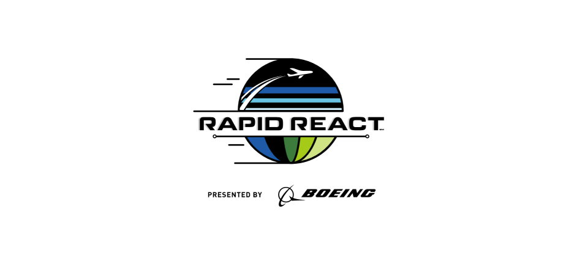
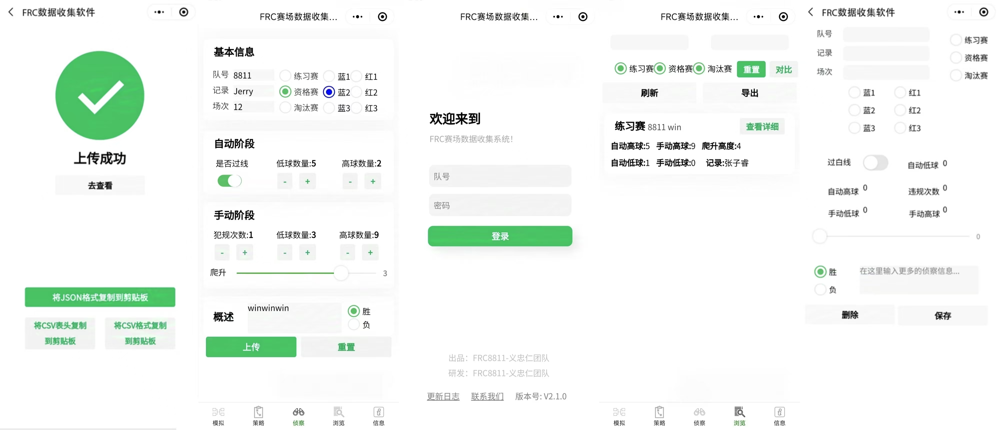

# FRC Data Collection Software

The wechat miniprogram provides a separate account for every team to collect, upload, browse, contrast, analyze, and export data during the FRC match.

  

**Nov. 2023**: Obtained software copyright: *2023SR1385127*

**Jun 2022**: The newly upgraded version is officially launched

**Mar 2022**: The first version is launched on the WeChat platform

**Jul 2021**: The idea of ​​developing a data collection software started from this day

**Contributors**: [Zirui Zhang](https://github.com/zhangzrjerry) and [Yue Peng](https://github.com/edward-yue-peng) from the Guangzhou No.2 High School

**GUI Design**:

